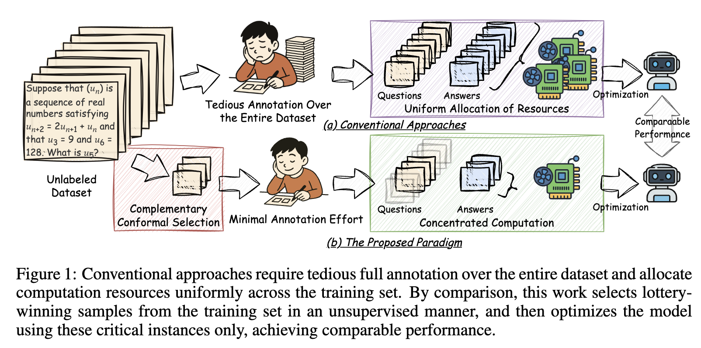
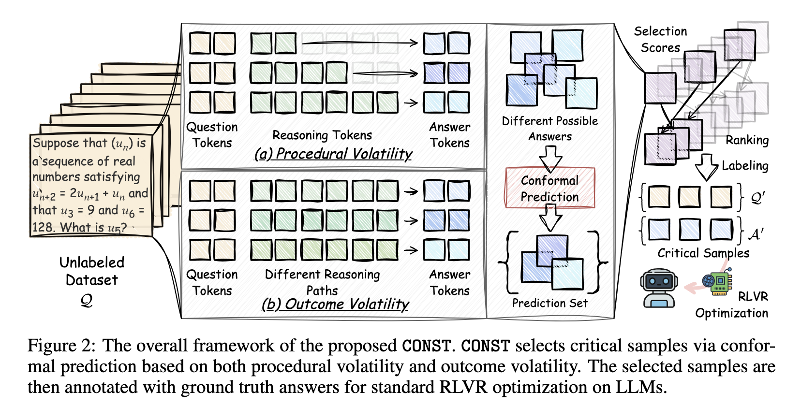

# [ICLR 2026] Sample Lottery: Unsupervised Discovery of Critical Instances for LLM Reasoning

This repository contains the official implementation for the ICLR 2026 submission, "Sample Lottery: Unsupervised Discovery of Critical Instances for LLM Reasoning".



Our paper introduces **CONST** (Complementary Conformal Selection), a novel framework for the unsupervised discovery of critical instances for LLM reasoning. CONST identifies and selects high-value "lottery-winning" samples from an unlabeled dataset. Our experiments show that training on this small subset (less than 0.5% of the original data) can achieve performance comparable to training on the full, annotated dataset.



## Setup

We recommend creating two separate Conda environments for training and evaluation to manage dependencies.

### Training Environment

```bash
# Create and activate the conda environment
conda create -y -n const_train python=3.10
conda activate const_train

# Install PyTorch with the correct CUDA version
# Please adjust the CUDA version (e.g., cu121, cu118) to match your system
pip install torch==2.4.0 torchvision==0.19.0 --index-url https://download.pytorch.org/whl/cu121

# Install the remaining dependencies
pip install -r requirements_train.txt

# It is recommended to install flash-attn for efficiency
pip install flash-attn --no-build-isolation
```

### Evaluation Environment

```bash
# Create and activate the conda environment
conda create -y -n const_eval python=3.10
conda activate const_eval

# Install dependencies for the evaluation script
pip install -r requirements.txt

# Install the latex2sympy package for math evaluation
cd latex2sympy
pip install -e .
cd ..
```

## Data

Please place the required datasets (e.g., BigMath-sub, MMLU for calibration) under the `data/` directory. The training and evaluation scripts are configured to load data from this location.

## Running Experiments

The core experiments are organized in the `scripts/` directory.

### Main Results

To reproduce the main results reported in the paper, you can use the scripts located in `scripts/train/MainResult/`. Each sub-directory corresponds to a different base model.

For example, to run CONST with a budget of k=4 on `LLaMA-3.1-8B-Instruct`:
```bash
# Ensure you are in the const_train environment
conda activate const_train

# Run the training script
bash scripts/train/MainResult/LLaMA-3.1-8B-Instruct/run_CONST-k4.sh
```
Scripts for other models (`DeepSeek-R1-Distill-Qwen-1.5b`, `Qwen2.5-Math-1.5b`) and other budgets (k=8) can be found in the same directory.

### Ablation Studies

To run the ablation studies described in the paper (e.g., RandomSelect, Entropy, NoCluster), use the scripts in `scripts/train/AblationStudy/`.

For example, to run the `V1-RandomSelect` ablation:
```bash
# Ensure you are in the const_train environment
conda activate const_train

# Run the ablation script
bash scripts/train/AblationStudy/run_CONST-V1-RandomSelect.sh
```

### Evaluation

After training is complete and checkpoints are saved, use the evaluation scripts to measure performance on the math benchmarks.

1.  Activate the evaluation environment:
    ```bash
    conda activate const_eval
    ```
2.  Modify the `eval_all_math.sh` script in the `sh/` directory to point to your trained model checkpoint.
3.  Run the evaluation:
    ```bash
    bash sh/eval_all_math.sh
    ```
